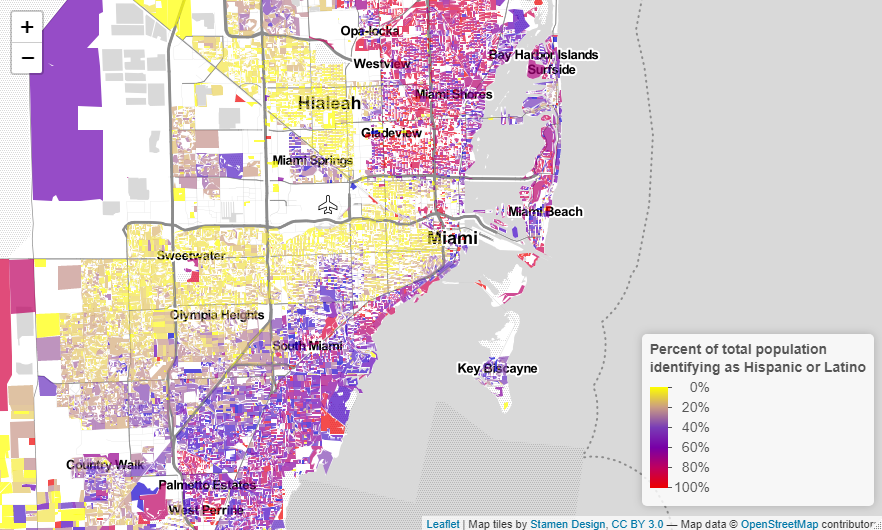
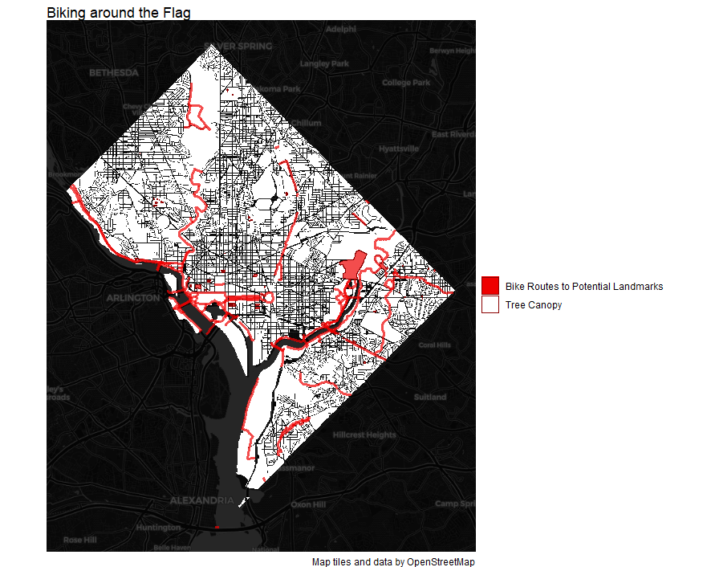
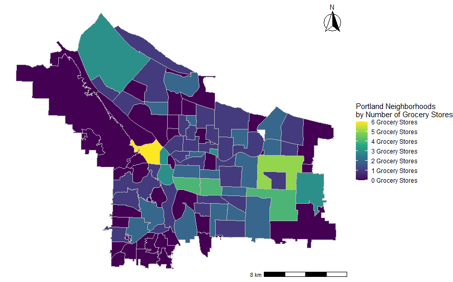
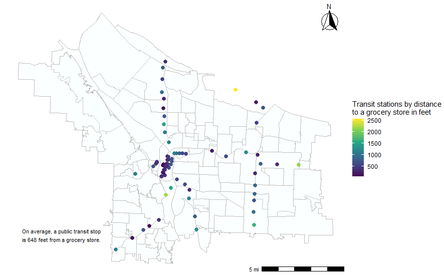
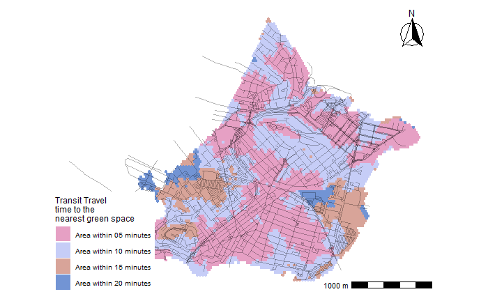
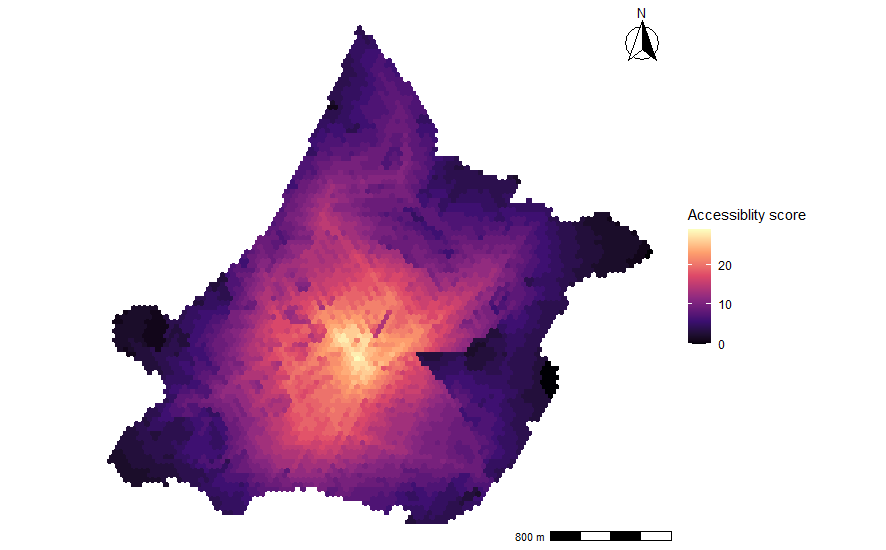
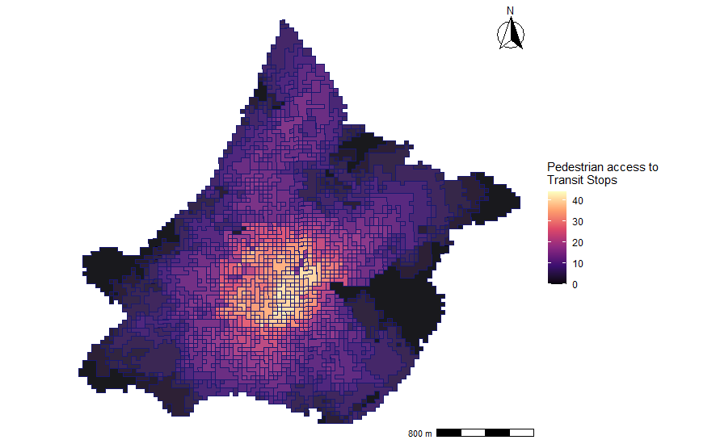
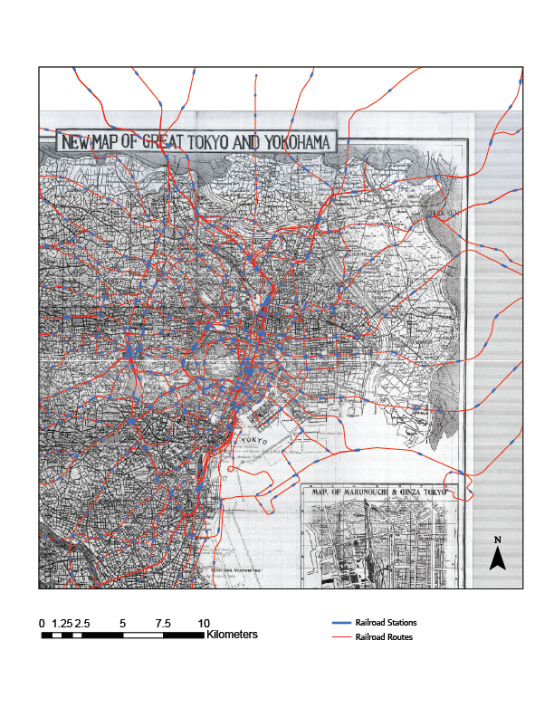

<style>
body {
text-align: justify}
</style>

<a href="https://github.com/DanielM1996/dmontoyafinalportfolio" class="github-corner" aria-label="View source on GitHub"><svg width="80" height="80" viewBox="0 0 250 250" style="fill:#64CEAA; color:#fff; position: absolute; top: 0; border: 0; right: 0;" aria-hidden="true"><path d="M0,0 L115,115 L130,115 L142,142 L250,250 L250,0 Z"></path><path d="M128.3,109.0 C113.8,99.7 119.0,89.6 119.0,89.6 C122.0,82.7 120.5,78.6 120.5,78.6 C119.2,72.0 123.4,76.3 123.4,76.3 C127.3,80.9 125.5,87.3 125.5,87.3 C122.9,97.6 130.6,101.9 134.4,103.2" fill="currentColor" style="transform-origin: 130px 106px;" class="octo-arm"></path><path d="M115.0,115.0 C114.9,115.1 118.7,116.5 119.8,115.4 L133.7,101.6 C136.9,99.2 139.9,98.4 142.2,98.6 C133.8,88.0 127.5,74.4 143.8,58.0 C148.5,53.4 154.0,51.2 159.7,51.0 C160.3,49.4 163.2,43.6 171.4,40.1 C171.4,40.1 176.1,42.5 178.8,56.2 C183.1,58.6 187.2,61.8 190.9,65.4 C194.5,69.0 197.7,73.2 200.1,77.6 C213.8,80.2 216.3,84.9 216.3,84.9 C212.7,93.1 206.9,96.0 205.4,96.6 C205.1,102.4 203.0,107.8 198.3,112.5 C181.9,128.9 168.3,122.5 157.7,114.1 C157.9,116.9 156.7,120.9 152.7,124.9 L141.0,136.5 C139.8,137.7 141.6,141.9 141.8,141.8 Z" fill="currentColor" class="octo-body"></path></svg></a><style>.github-corner:hover .octo-arm{animation:octocat-wave 560ms ease-in-out}@keyframes octocat-wave{0%,100%{transform:rotate(0)}20%,60%{transform:rotate(-25deg)}40%,80%{transform:rotate(10deg)}}@media (max-width:500px){.github-corner:hover .octo-arm{animation:none}.github-corner .octo-arm{animation:octocat-wave 560ms ease-in-out}}</style>

```{r setup, include=FALSE}
knitr::opts_chunk$set(echo = TRUE)
```


# Introduction

My name is Daniel Montoya, and this portfolio represents the culmination of six weeks of VIS2128. The following maps attempt to illustrate a variety of skills that were learned through the coursework. While the portfolio contains no obvious cohesive narrative, it does employ certain unifying themes and symbols throughout to maintain a sense of continuity.

The portfolio is structured in the following manner:

1. City Depicted by the Map
2. Skill(s) Demonstrated
3. Type of Map
4. Narrative Paragraph

The narrative paragraph explains the context of the map and also includes any updates to the map that incorporate previous assignment feedback. 

I hope you enjoy the contents of this portfolio as a *celebration* of all the VIS2128 assignments. 

# Miami, Florida

* <p style="color:MediumSeaGreen;">Skill Demonstrated: Displaying data on an interactive map.</p>

## Interactive Map
Miami is colloquially known as the Capital of Latin America because of the large number of residents who are from or are descendants of residents of South America, Central America, and the Caribbean. Using the 2010 decennial Census data, this interactive map demonstrates the percent of total population of a given census block that identify as Hispanic or Latino. The map is interactive and allows the viewer to explore the expansive and sprawling Miami-Dade County to observe demographic changes and dynamics across the geography. The map is color-coded so as to symbolize the Colombian (or Venezuelan or Ecuadorian) flag and the pop-ups are colored in a **Midnight Blue** in homage to the UNASUR (Union of South American Nations) and CELAC (Community of Latin American and Caribbean States) flags.

<center>
[](https://danielm1996.github.io/dmontoyafinalportfolio/fullsize/interactive_miami_hl.html){target="_blank"}
</center>

# Washington D.C.

* <p style="color:MediumSeaGreen;">Skill Demonstrated: Displaying multiple vector layers on the same map.</p>

## Vexillological Map
Washington D.C. is celebrated for its flag, having been awarded the honor of "The Best City Flag" by the North American Vexillolgoical Association in 2004. This map celebrates this flag by utilizing polygon data that includes tree canopy, potential landmarks, and bike trails to symbolize the flag of Washington D.C. Theoretically, the white canopy (against the black base map) represents the flag's base, the red bike trails represent the red stripes, and the red potential landmarks represent the flag's stars. This map now includes some alpha transparency so as to not create such a glaring contrast between the bright red and fluorescent white. The origin and design of the capital's flag can be viewed using this link: https://usflags.design/washington-dc/.

<center>
[](https://danielm1996.github.io/dmontoyafinalportfolio/fullsize/dc_flag.pdf){target="_blank"}
</center>

# Portland, Oregon

* <p style="color:MediumSeaGreen;">Skill Demonstrated: Aggregating point data to a layer of polygons.</p> 
* <p style="color:MediumSeaGreen;">Skill Demonstrated: Calculating and displaying relationships among point and polygon layers based on distance.</p> 

## Polygonal Map
Portland, Oregon is satirically known for its exceptionally liberal atmosphere and its metropolitan integration with Portland METRO. The following maps evaluate the relationship between grocery store locations and transit locations in the respective neighborhoods of Portland. This first map demonstrates the aggregation of individual supermarkets (point data) into city neighborhoods (polygon data). This map has been updated to include a scale and north arrow as well as a simpler theme to match the aesthetic of the other portfolio maps.

<center>
[](https://danielm1996.github.io/dmontoyafinalportfolio/fullsize/points_polygons_portland.pdf){target="_blank"}
</center>

## Distance Map

This map shows the average distance between grocery stores and public transit stations in Portland (the average Euclidean distance between A points and their nearest respective B points). The average distance is about 648 feet. This map has been updated to include a scale and north arrow as well as a more aesthetic **azure** demarcation.

<center>
[](https://danielm1996.github.io/dmontoyafinalportfolio/fullsize/calc_disp_portland.pdf){target="_blank"}
</center>

# Chelsea, Massachusetts
* <p style="color:MediumSeaGreen;">Skill Demonstrated: Calculating and displaying relationships among point and polygon layers based on distance.</p>
* <p style="color:MediumSeaGreen;">Skill Demonstrated: Calculating and displaying accessibility, based on travel time.</p>
* <p style="color:MediumSeaGreen;">Skill Demonstrated: Displaying raster data on a map.</p>
* <p style="color:MediumSeaGreen;">Skill Demonstrated: Converting between raster layers and vector layers.</p>

## Isochrone Map
Chelsea, Massachusetts is a wonderful town northeast of Cambridge. It also served as the site for my first studio project on the topics of access and equity. The following maps paint a cartographic picture of Chelsea's access to public goods like green space and transit stops. This is especially salient for this minority-majority community that has been continuously  marginalized within the Boston Metropolitan Area. This first map demonstrates an isochrone based on transit travel times to the nearest green space. This map has been updated to include a scale and north arrow as well as my favorite Wes Anderson film color scheme (The Grand Budapest Hotel).

<center>
[](https://danielm1996.github.io/dmontoyafinalportfolio/fullsize/Isochrone_Map_Chelsea.pdf){target="_blank"}
</center>

## Accessibility Map
This map shows accessibility based on an exponential distance-decay function of the walking time to the nearest transit stop. It does so by providing an accessibility score. This map has been updated to include a scale and north arrow as well as a new magma coloration to produce a more nebula-like effect.

<center>
[](https://danielm1996.github.io/dmontoyafinalportfolio/fullsize/Access_Chelsea.pdf){target="_blank"}
</center>

## Raster Map
This map converts the previous map into a raster layer using a 100x100 grid. It maintains the magma color scheme. This map has been updated to include a scale and north arrow as well as a transparent **azure** road network.

<center>
[](https://danielm1996.github.io/dmontoyafinalportfolio/fullsize/raster_image_Chelsea.pdf){target="_blank"}
</center>

## Grid Map
This map converts the previous map from a raster layer to a vector layer using grid cells to create polygons. This map has been updated to include a scale and north arrow as well as a **Midnight Blue** polygonal division.

<center>
[](https://danielm1996.github.io/dmontoyafinalportfolio/fullsize/Raster_Chelsea.pdf){target="_blank"}
</center>

# Tokyo, Japan

* <p style="color:MediumSeaGreen;">Skill Demonstrated: Georeferencing a raster image.</p>

## Geo-Referenced Map

The original map demonstrates Tokyo in 1934. The map highlights the strategic production, energy, and defense infrastructure located in the city in a pre-World War II era. The geo-referenced map has stacked on top of it ARCGIS data regarding modern down railroad lines and railroad stations. The infrastructure of 1934 Tokyo does not align too closely with the modern day infrastructure of Tokyo. Nonetheless, modern transportation lines and hubs are observed circumventing important public spaces, indicating an unwillingness to disturb important cultural, historical, and leisurely spaces. 

<center>
[](https://danielm1996.github.io/dmontoyafinalportfolio/fullsize/georeferencing_tokyo.pdf){target="_blank"}
</center>